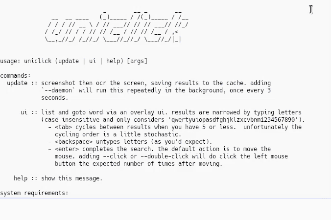

# uniclick

Click on any text using just your keyboard. `uniclick` takes a
screenshot of your desktop, runs optical character recognition (OCR)
on it, then displays narrowing UI that allows you to select a word. Once
your target word is selected, you cursor will be moved to its center.
uniclick will click or double-click on request.

Here's a demo:



The UI works by overlaying dark boxes over each word the OCR engine has
detected. You build up a search string by typing letters or numbers (all
other characters are ignored). As you type, uniclick will narrow the words
it highlights to just those that start with your search string. Pressing
`<backspace>` will delete the last character you typed. Once there are less
than 5 words highlighted, you can also press `<tab>` to cycle between them.
The selected word is surrounded by an extra border. Once you have selected
the word you want, type `<enter>` to finish. The cursor will be moved to
the center of that word.

If you want to give up/cancel, press `<esc>` at any time.

OCR is quite hard, so there will be errors. If you've typed `unicl` and
the word `uniclick` stops being highlighted, it's probably because the `l`
has been misread. Try pressing `<backspace>` then `1` and seeing if it
stays highlighted.

If you discover an OCR engine which works particuarly well for this use case,
please [let me know](https://daniel.wilshirejones.com/contact.html).


### Requirements
It expects to be inside an x11 session with a compositor running. I've
only tested this on Ubuntu 19.04 running i3 and compton.

System requirements:
  - tesseract
  - xdotool
  - scrot
  - python3

Python requirements are in requirements.txt.

### Setup
This could do with a proper installation method, but for now I do the following:
  1. Ensure the system requirements are installed (via `apt` for me).
  2. Clone the repo: `$ git clone https://github.com/dj311/uniclick.git && cd uniclick`.
  3. Make and enter virtual env: `$ python3 -m venv .venv && source .venv/bin/activate`.
  4. Install Python dependencies `$ pip install -r requirements.txt`.
  5. Make a wrapper script `$ touch ~/.local/bin/uniclick && chmod u+x ~/.local/bin/uniclick` with something like this inside:
     ```
     #!/usr/bin/env bash
     <path-to-uniclick-repo>/.venv/bin/python <path-to-uniclick-repo>/uniclick.py "$@"
     ```

### Examples
Example setups for i3:
  1. Scan screen then use overlay ui for picking (zenity is used for a
     progress indicator, but thats optional).
        ```
        bindsym $mod+c exec uniclick update \\
            | zenity --progress --auto-close --auto-kill --pulsate \\
                     --text "uniclick loading..." \\
            && uniclick ui
        ```

  2. Scan screen then use overlay ui for picking. uniclick will
     continue to scan in the background, allowing quick response times
     for future invocations.
        ```
        bindsym $mod+c exec uniclick update --daemon && uniclick ui
        ```

There are tradeoffs between these options:
  - Running the update as a daemon means it'll be responsive, but
    you'll waste a lot compute and there's a high likelihood that the
    cached data is out of date.
  - Running the update on demand shouldn't ever give out of date
    results, but will be slow (each update takes around 5 seconds on
    my machine).


### Credits:
  - [This gist](https://gist.github.com/initbrain/6628609) was vital for me getting the overlay
    window to work.
  - [This stack overflow answer](https://stackoverflow.com/questions/14200512#14269915) pointed me towards using
    the composite overlay window which made the ui reliable enough to actually be used.
  - tesseract, pyocr, xdotool, pillow, python-xlib, etc for doing the hard work..
