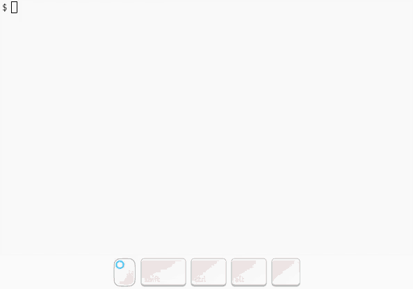

# uniclick

Click on any text using just your keyboard. `uniclick` takes a
screenshot of your desktop, runs optical character recognition (OCR)
on it, then displays narrowing UI that allows you to select a word. Once
your target word is selected, you cursor will be moved to its center.
uniclick will click or double-click on request. It's similar in spirit to
[keynav](https://www.semicomplete.com/projects/keynav/).

Here's a demo:



The UI works by overlaying dark boxes over each word the OCR engine has
detected. You build up a search string by typing letters or numbers (all
other characters are ignored). As you type, uniclick will narrow the words
it highlights to just those that start with your search string. Pressing
`<backspace>` will delete the last character you typed. Once there are less
than 5 words highlighted, you can also press `<tab>` to cycle between them.
The selected word is surrounded by an extra border. Once you have selected
the word you want, type `<enter>` to finish. The cursor will be moved to
the center of that word.

If you want to give up/cancel, press `<esc>` at any time.


*Note:* because uniclick uses OCR to find the text, it can take a little
while to startup (approx. 5 seconds on my machine). This is it's primary
drawback. Also, whilst tesseract tries it's best, there will be occasionnal
errors. For example, if you've typed `unicl` and the word `uniclick` stops being
highlighted, it's probably because the `l` has been misread. Try pressing
`<backspace>` then `1` and seeing if it stays highlighted.

If you discover a method to recude startup time to,
please [let me know](https://daniel.wilshirejones.com/contact.html).


### Requirements
It expects to be inside an x11 session with a compositor running. I've
only tested this on Ubuntu 19.04 running i3 and compton.

System requirements:
  - tesseract
  - xdotool
  - scrot
  - python3

Python requirements are in requirements.txt.

### Setup
This could do with a proper installation method, but for now I do the following:
  1. Ensure the system requirements are installed (via `apt` for me).
  2. Clone the repo: `$ git clone https://github.com/dj311/uniclick.git && cd uniclick`.
  3. Make and enter virtual env: `$ python3 -m venv .venv && source .venv/bin/activate`.
  4. Install Python dependencies `$ pip install -r requirements.txt`.
  5. Make a wrapper script `$ touch ~/.local/bin/uniclick && chmod u+x ~/.local/bin/uniclick` with something like this inside:
     ```
     #!/usr/bin/env bash
     <path-to-uniclick-repo>/.venv/bin/python <path-to-uniclick-repo>/uniclick.py "$@"
     ```
     
### Usage
Just run `python3 uniclick.py`, or `uniclick` if you followed the steps above. Add `--click` or `--double-click` if you want it to click at the end.

I have it bound to `super+c` in my i3 config, like this:
```
bindsym $mod+c exec uniclick
bindsym $mod+control+c exec uniclick --click
bindsym $mod+shift+c exec uniclick --double-click
```

### Enhancements
  a. Narrowing can take advantage of common OCR errors. E.g searches for `unicl` could
    include `unic1ick`.
  b. Try different metrics for the search algorithm. Maybe some kind of edit distance
    for ranking. That could even take into account OCR errors as in a.
  c. Try to speed up OCR.
  d. ???


### Credits:
  - [This gist](https://gist.github.com/initbrain/6628609) was vital for me getting the overlay
    window to work.
  - [This stack overflow answer](https://stackoverflow.com/questions/14200512#14269915) pointed me towards using
    the composite overlay window which made the ui reliable enough to actually be used.
  - tesseract, pyocr, xdotool, pillow, python-xlib, etc for doing the hard work..
